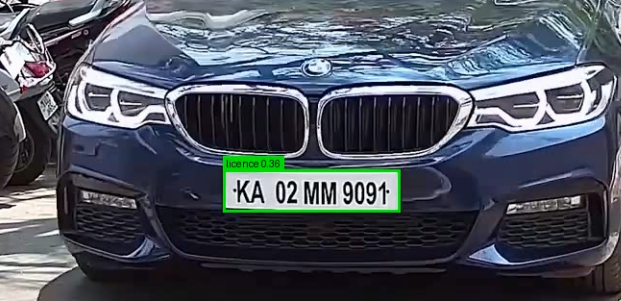
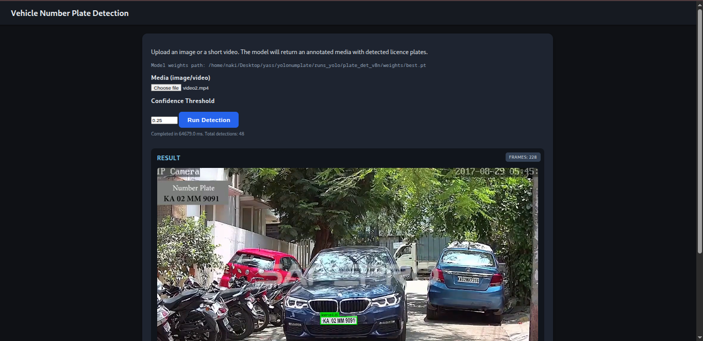
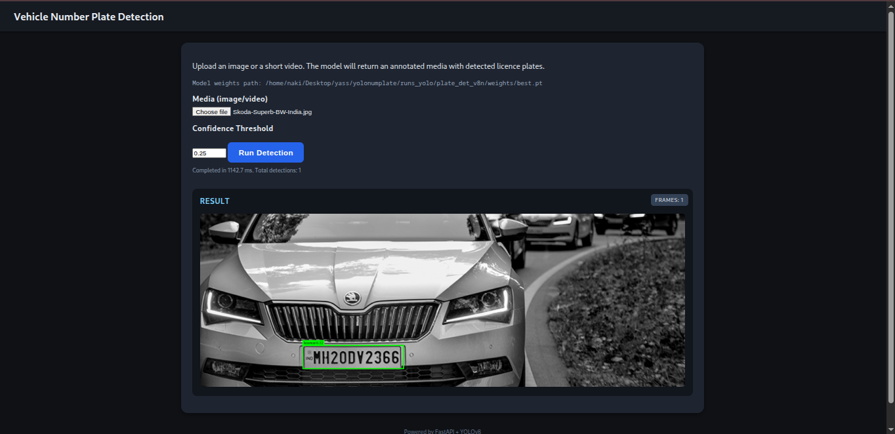

# Vehicle Number Plate Detection

Real‑time (images + short videos + optional webcam MJPEG stream) vehicle licence plate detection using a fine‑tuned **YOLOv8n** model served through a single‑page **FastAPI** application.

<p align="center">
  
  
</p>
<p align="center">
  
</p>

---
## 1. Overview
This repository packages a trained YOLOv8 nano detector (single class: `licence`) together with a lightweight inference API + HTML UI. Users can:
- Upload an image → receive annotated plate bounding boxes (inline base64 PNG)
- Upload a short video → server performs frame‑by‑frame detection, encodes an **H.264 MP4** (ffmpeg) or codec fallback, and returns a playable URL
- (Demo) Access `/stream` for a best‑effort MJPEG webcam feed with live detection overlays

The application emphasizes **fast startup** (single cached model load), **robust logging**, and **browser‑compatible video output**.

---
## 2. Key Features (Grounded in Code)
| Feature | Implementation Detail (from `app/`) |
|---------|--------------------------------------|
| Single model load | `@lru_cache` in `model_loader.get_model()` |
| Weight resolution | `BEST_PATH` then `FALLBACK_PATH` in `model_loader.py` (see Paths section) |
| Image inference | `/infer` branch (suffix check) → `YOLO.predict()` → Pillow overlay → base64 PNG |
| Video inference | OpenCV decode → per‑frame YOLO → Pillow overlay → ffmpeg (`libx264 + yuv420p + +faststart`) or OpenCV codec fallback |
| Video storage | Saved under `app/static/videos/annotated_<uuid>.mp4` (or fallback extension) |
| Video response | JSON with `video_url`, not base64 (unless legacy fallback) |
| Logging | `loguru` with request middleware assigning `request_id`, timing, codec, frame stats |
| Confidence control | `conf` form field / multipart value (`float`, default 0.25) |
| Frontend | Inline HTML template in `main.py` (no external build) |
| Streaming demo | `/stream` endpoint returns multipart MJPEG from webcam (CPU heavy) |
| Encoder strategy | Prefer ffmpeg H.264; fallback to OpenCV (`mp4v`, `XVID`, `MJPG` → MP4) then final AVI if necessary |
| Even dimension safety | `_ensure_even()` trims 1 pixel if odd (encoder compatibility) |
| Progress feedback | Frame counter + periodic debug logs every N frames |
| Request correlation | Middleware logs start & completion with the same `request_id` |

---
## 3. Model & Weights
- Base architecture: **YOLOv8n** (Ultralytics)
- Task: Single class (`licence`) bounding‑box detection
- Inference call: `model.predict(image, conf=<threshold>, verbose=False)[0]`
- Overlays drawn using Pillow (`ImageDraw`) → rectangle + label text with confidence

### Weight Resolution Logic (`app/model_loader.py`)
```python
BEST_PATH = Path("runs_yolo/plate_det_v8n/weights/best.pt")
FALLBACK_PATH = Path("runs_yolo/plate_det_v8n/weights/last.pt")
MODEL_WEIGHTS_PATH = BEST_PATH if BEST_PATH.exists() else FALLBACK_PATH
```
If neither exists, startup raises `FileNotFoundError` (fail fast).

> The resolved path is also substituted into the HTML UI for transparency.

---
## 4. Dataset (Kaggle Source)
The model was fine‑tuned on a curated Kaggle licence plate dataset (Indian + mixed international passenger vehicles).

Typical characteristics (adapt / replace with exact dataset slug):
- ~2–4k labeled images (train/val split)
- Label format converted **Pascal VOC → YOLO** (class id always 0 for `licence`)
- Variety: frontal / angled shots, daylight variance, partial occlusions
- Training image size: 640 (multi‑scale enabled)
- Augmentations: mosaic, scale, HSV shift, horizontal flip (YOLO defaults)

> Replace this note with the actual dataset link, e.g. `https://www.kaggle.com/datasets/<author>/<dataset-slug>` before publishing.

---
## 5. API Endpoints
| Method | Path | Purpose | Notes |
|--------|------|---------|-------|
| GET | `/` | HTML single‑page UI | Inline template in `main.py` |
| POST | `/infer` | Image OR video inference | Multipart: `file` (required), `conf` optional |
| GET | `/stream` | MJPEG webcam demo | Uses device index `0` (may fail headless) |

### `/infer` Image JSON Example
```json
{
  "type": "image",
  "detections": 2,
  "annotated": "<base64 PNG>",
  "infer_ms": 42.3,
  "total_ms": 55.7
}
```
### `/infer` Video JSON Example
```json
{
  "type": "video",
  "frames": 228,
  "total_detections": 48,
  "video_url": "/static/videos/annotated_123abc456def.mp4",
  "codec": "H.264",
  "fps_est": 3.91,
  "total_ms": 58323.9
}
```
> The frontend JavaScript appends a cache‑busting `?t=TIMESTAMP` and creates an HTML5 `<video>` element. If playback fails it offers a download link and (if present) a base64 fallback.

---
## 6. Frontend Behavior
- Pure static HTML + JS (no framework bundler)
- Uses `fetch` with `FormData`
- Displays progress bar + timing stats
- Dynamically injects `` or `<video>` depending on response `type`
- Video element configured with `preload="metadata"`, `controls`, and error handlers printing diagnostics to `console`

---
## 7. Logging & Observability
Implemented with **loguru** in `main.py`:
- Console sink (INFO+) + rotating file `server.log` (DEBUG, 10 MB rotation, 10 days retention)
- Middleware logs: start (➡️) + completion (✅) + failures (❌)
- Each request assigned `request_id` = `epoch_ms-rand6`
- Video branch logs:
  - Upload metadata (filename, size_kb, conf)
  - Frame progress every 30 frames
  - Encoder selection & codec fallbacks
  - Performance summary: frames processed, total detections, elapsed ms, estimated FPS (frames / pure inference time)

---
## 8. Video Processing Pipeline (Server)
1. Save upload to a temp file (only for videos)
2. OpenCV `VideoCapture` loop → read frame
3. Ensure even dimensions (`_ensure_even`) for codec safety
4. Convert BGR → RGB → Pillow → YOLO inference
5. Draw boxes (Pillow) → convert back BGR → collect frame
6. After loop:
   - Prefer ffmpeg pipe (H.264, `yuv420p`, `+faststart`)
   - If ffmpeg missing or fails → OpenCV writers (`mp4v`, `XVID`, `MJPG`) in MP4 container
   - Final fallback: MJPG AVI
7. Expose relative `video_url` under `/static/videos/`
8. Return JSON (no in‑memory base64 for large video files)

> Design choice: Avoid embedding large base64 video payloads in JSON to reduce memory & client parsing overhead.

---
## 9. Directory Structure (Relevant Subset)
```
app/
  main.py            # FastAPI app, HTML template, inference + encoding logic
  model_loader.py    # Weight resolution + cached YOLO model
  requirements.txt   # Runtime dependencies
  static/
    videos/          # Generated annotated videos
runs_yolo/
  plate_det_v8n/weights/{best.pt,last.pt}
yolo_dataset/        # (If retraining) data.yaml + images/ + labels/
assets/              # Images used in README
memory.md            # Persists resolved model weight path reference
```

---
## 10. Installation & Usage
### Prerequisites
- Python 3.10+
- (Optional) `ffmpeg` on PATH for H.264 encoding (recommended). Without it, OpenCV fallback codecs are used.

### Setup
```bash
python -m venv .venv
source .venv/bin/activate               # Windows: .venv\\Scripts\\activate
pip install --upgrade pip
pip install -r app/requirements.txt

# Run development server (auto‑reload)
uvicorn app.main:app --reload
# Or explicit host/port
uvicorn app.main:app --host 0.0.0.0 --port 8000 --workers 1
```
Open: http://127.0.0.1:8000

### Simple cURL Test
```bash
curl -X POST -F "file=@sample.jpg" http://127.0.0.1:8000/infer -o result.json
```

### ffmpeg Check (Optional)
```bash
ffmpeg -version
```
If not present, install via your package manager (e.g. `sudo apt install ffmpeg`).

---
## 11. Retraining (Outline)
(Adjust to your dataset paths.)
```bash
pip install ultralytics
# Edit yolo_dataset/data.yaml to point to your train/val images and labels
# Example training run:
yolo detect train model=yolov8n.pt data=yolo_dataset/data.yaml imgsz=640 epochs=50 batch=16 patience=10 name=plate_det_v8n
# Best weights at runs/detect/plate_det_v8n/weights/best.pt
```
Copy the best weights into:
```
runs_yolo/plate_det_v8n/weights/best.pt
```
(Or modify `BEST_PATH` in `model_loader.py`.)

---
## 12. Performance (Indicative CPU Numbers)
| Scenario | Metric (Approx) |
|----------|-----------------|
| 640x Image | 40–90 ms end‑to‑end |
| Video (CPU) | 3–6 FPS effective |
| Model file | ~6 MB (YOLOv8n) |

> Throughput increases substantially on GPU; pipeline currently written for CPU portability.

---
## 13. Limitations & Future Work
| Current Limitation | Potential Enhancement |
|--------------------|-----------------------|
| No OCR plate text | Integrate Tesseract / EasyOCR after detection crop |
| Single class only | Extend training to vehicles + plates (multi‑class) |
| MJPEG stream is CPU heavy | Replace with WebSocket H.264 chunking or WebRTC |
| Synchronous frame loop | Async queue / batching on GPU |
| No Dockerfile committed | Add production Docker image with proper ffmpeg build |

---
## 14. Troubleshooting
| Symptom | Cause | Fix |
|---------|-------|-----|
| Video not playing | Missing ffmpeg → fallback codec not browser‑friendly | Install ffmpeg; ensure H.264 output |
| `FileNotFoundError` at startup | Weights missing | Place `best.pt` (or `last.pt`) in expected path |
| Slow video processing | CPU bound | Reduce resolution / frames; use GPU build |
| Empty detections | High `conf` | Lower `conf` value in form |

---
## 15. Licensing & Attribution
Add a LICENSE file (MIT / Apache‑2.0 recommended). Respect the Kaggle dataset license—attribute dataset author(s) in this README when finalizing. Credit:
- Ultralytics YOLOv8
- FastAPI
- Loguru
- OpenCV, ffmpeg

---
## 16. Acknowledgements
Gratitude to the open‑source community and dataset contributors enabling rapid experimentation.

---
## 17. Quick Copy Snippet (Badges Idea)
(Optionally add shields.io badges after publishing; omitted to keep repository clean.)

---
Feel free to open issues or discussions for improvements / ideas.